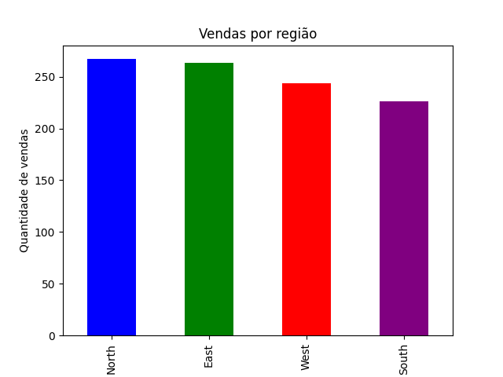
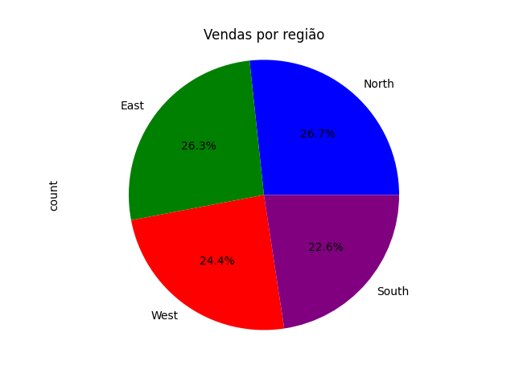
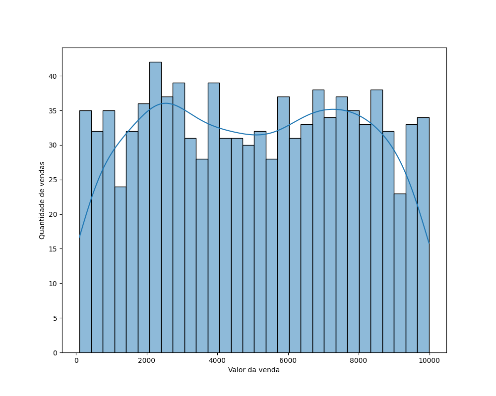

# Análise de Dados - Estudo Básico

Este repositório é dedicado ao estudo básico de análise de dados. Aqui, você encontrará exemplos, scripts e anotações sobre conceitos fundamentais de análise de dados, utilizando ferramentas como Python, Pandas, Matplotlib, e outras bibliotecas populares.

## Objetivo

O objetivo deste repositório é guardar os códigos utilizados durante o estudo. Os tópicos abordados incluem manipulação de dados, visualização, estatísticas descritivas e muito mais.


## Estrutura do Projeto

📂 **Analise_Vendas**  
├── 📂 **datasets**  
│   ├── 📄 sales_data.csv  
├── 📄 analise_de_vendas.py  
├── 📄 visualizando_dados.py  
├── 📄 README.md  

### Descrição dos Arquivos

- 📂 **datasets/**: Contém os arquivos de dados usados para a análise.  
  - 📄 `sales_data.csv`: Conjunto de dados de vendas.  
- 📄 **analise_de_vendas.py**: Script principal para análise dos dados.
- 📄 **visualizando_dados.py**: Script de visualização dos dados em gráficos.  
- 📄 **README.md**: Documentação do projeto. 


## Vamos começar ! 

Importando as bibliotecas necessárias:

```bash
pip install pandas matplotlib seaborn numpy

import pandas as pd
import numpy as np
import matplotlib.pyplot as plt
```

Carregando o Arquivo CSV com os dados das vendas

```bash

data_frame = pd.read_csv('datasets/sales_data.csv')

```

## Visualizando a estrutura dos dados

Com o método .head() visualizamos as 5 primeiras linhas do DataFrame

```bash

>>> print(data_frame.head())

  Product_ID   Sale_Date Sales_Rep Region  Sales_Amount  Quantity_Sold Product_Category  Unit_Cost  Unit_Price Customer_Type  Discount Payment_Method Sales_Channel Region_and_Sales_Rep
0        1052  2023-02-03       Bob  North       5053.97             18        Furniture     152.75      267.22     Returning      0.09           Cash        Online            North-Bob
1        1093  2023-04-21       Bob   West       4384.02             17        Furniture    3816.39     4209.44     Returning      0.11           Cash        Retail             West-Bob
2        1015  2023-09-21     David  South       4631.23             30             Food     261.56      371.40     Returning      0.20  Bank Transfer        Retail          South-David
3        1072  2023-08-24       Bob  South       2167.94             39         Clothing    4330.03     4467.75           New      0.02    Credit Card        Retail            South-Bob
4        1061  2023-03-24   Charlie   East       3750.20             13      Electronics     637.37      692.71           New      0.08    Credit Card        Online         East-Charlie

```
Com o método .info() conseguimos imprimir informações sobre um DataFrame, incluindo o tipo de índice e colunas, valores não nulos e uso de memória.

``` bash
>>> print(data_frame.info())

<class 'pandas.core.frame.DataFrame'>
RangeIndex: 1000 entries, 0 to 999
Data columns (total 14 columns):
 #   Column                Non-Null Count  Dtype  
---  ------                --------------  -----  
 0   Product_ID            1000 non-null   int64  
 1   Sale_Date             1000 non-null   object 
 2   Sales_Rep             1000 non-null   object 
 3   Region                1000 non-null   object 
 4   Sales_Amount          1000 non-null   float64
 5   Quantity_Sold         1000 non-null   int64  
 6   Product_Category      1000 non-null   object 
 7   Unit_Cost             1000 non-null   float64
 8   Unit_Price            1000 non-null   float64
 9   Customer_Type         1000 non-null   object 
 10  Discount              1000 non-null   float64
 11  Payment_Method        1000 non-null   object 
 12  Sales_Channel         1000 non-null   object 
 13  Region_and_Sales_Rep  1000 non-null   object 
dtypes: float64(4), int64(2), object(8)
memory usage: 109.5+ KB

``` 
Verificando se existem valores faltando: o metodo isnull() retorna um booleano True/False se o valor estiver faltando e o metodo sum() a quantidade de valores em falta por coluna.

```bash
>>> print(data_frame.isnull().sum())

Product_ID              0
Sale_Date               0
Sales_Rep               0
Region                  0
Sales_Amount            0
Quantity_Sold           0
Product_Category        0
Unit_Cost               0
Unit_Price              0
Customer_Type           0
Discount                0
Payment_Method          0
Sales_Channel           0
Region_and_Sales_Rep    0
dtype: int64

```

Gerar estatísticas descritivas. 

Estatísticas descritivas incluem aquelas que resumem a tendência central, a dispersão e a forma da distribuição de um conjunto de dados, excluindo NaN.

``` bash
>>> print(data_frame.describe())

Product_ID  Sales_Amount  Quantity_Sold    Unit_Cost   Unit_Price    Discount
count  1000.000000   1000.000000    1000.000000  1000.000000  1000.000000  1000.00000
mean   1050.128000   5019.265230      25.355000  2475.304550  2728.440120     0.15239
std      29.573505   2846.790126      14.159006  1417.872546  1419.399839     0.08720
min    1001.000000    100.120000       1.000000    60.280000   167.120000     0.00000
25%    1024.000000   2550.297500      13.000000  1238.380000  1509.085000     0.08000
50%    1051.000000   5019.300000      25.000000  2467.235000  2696.400000     0.15000
75%    1075.000000   7507.445000      38.000000  3702.865000  3957.970000     0.23000
max    1100.000000   9989.040000      49.000000  4995.300000  5442.150000     0.30000

```

O método describe() do pandas.DataFrame é uma função útil para obter estatísticas descritivas rápidas e resumidas sobre as colunas numéricas de um DataFrame. Ele retorna um novo DataFrame contendo informações como contagem, média, desvio padrão, valores mínimos e máximos, e os quartis (25%, 50% e 75%) para cada coluna numérica.

* count: Número de valores não nulos em cada coluna.
* mean: Média dos valores.
* std: Desvio padrão, que mede a dispersão dos valores em torno da média.
* min: Valor mínimo na coluna.
* 25%: Primeiro quartil (25º percentil), ou seja, 25% dos dados estão abaixo desse valor.
* 50%: Segundo quartil (50º percentil), também conhecido como mediana. Metade dos dados estão abaixo desse valor.
* 75%: Terceiro quartil (75º percentil), ou seja, 75% dos dados estão abaixo desse valor.
* max: Valor máximo na coluna.

Verificando se existem dados duplicados:
O método .duplicated() do pandas.DataFrame é usado para identificar linhas duplicadas em um DataFrame. Ele retorna uma Série booleana (ou seja, uma série de True ou False) indicando se cada linha é uma duplicata de uma linha anterior.
sum(). soma a quantidade de linhas que se repetem.

``` bash
>>> print(data_frame.duplicated().sum())
 0

```


## Visualizando os Dados

.plot() do pandas.DataFrame
O método .plot() do pandas.DataFrame é uma funcionalidade poderosa e conveniente para criar visualizações gráficas diretamente a partir de um DataFrame. Ele é baseado na biblioteca matplotlib, mas oferece uma interface simplificada para gerar gráficos comuns, como linhas, barras, histogramas, dispersões, entre outros.

Principais características
Fácil de usar: Basta chamar .plot() em um DataFrame para criar um gráfico básico.

Personalizável: Permite ajustar vários parâmetros, como tipo de gráfico, cores, rótulos, títulos, etc.

Integração com matplotlib: Retorna um objeto Axes do matplotlib, permitindo personalizações adicionais usando a API do matplotlib.

Tipos de gráficos suportados
O parâmetro kind define o tipo de gráfico a ser criado. Os principais tipos são:

* 'line': Gráfico de linhas (padrão).
* 'bar': Gráfico de barras verticais.
* 'barh': Gráfico de barras horizontais.
* 'hist': Histograma.
* 'box': Boxplot.
* 'kde' ou 'density': Gráfico de densidade.
* 'area': Gráfico de áreas.
* 'scatter': Gráfico de dispersão.
* 'pie': Gráfico de pizza.

```bash

# Exibe um gráfico de barras com a quantidade de vendas por região
# Colorindo as barras de acordo com a regiao 
>>> data_frame['Region'].value_counts().plot(kind='bar', color=['blue', 'green', 'red', 'purple']) 
>>> plt.xlabel('Região')# Nomeia o eixo x
>>> plt.ylabel('Quantidade de vendas')# Nomeia o eixo y
>>> plt.title('Vendas por região')# Adiciona um título ao gráfico
>>> plt.show()# Exibe o gráfico


```



Para modificar o tipo de grafico de Barra para Pizza basta alterar o parametro *kind* de *bar* para *pie*

```bash

>>> data_frame['Region'].value_counts().plot(kind='pie', autopct='%1.1f%%', colors=['blue', 'green', 'red', 'purple'])
>>> plt.axis('equal')
>>> plt.title('Vendas por região')
>>> plt.show()

```




Visualizando historiograma de vendas:
*seaborn*: Biblioteca de visualização de dados construída sobre o matplotlib. Ela oferece gráficos mais atraentes e de alto nível. Aqui, é importada como sns.

* *plt.figure()*: Cria uma nova figura para o gráfico.
* *figsize=(10, 8)*: Define o tamanho da figura como 10 polegadas de largura e 8 polegadas de altura.
* *sns.histplot(df['Sales_Amount'], bins=30, kde=True)*
* *sns.histplot()*: Função do Seaborn para criar um histograma.
* *df['Sales_Amount']*: Coluna do DataFrame df que contém os dados a serem plotados. 
* *bins=30*: Define o número de intervalos (bins) no histograma. Neste caso, são 30 intervalos.
* *kde=True*: Adiciona uma curva de densidade (Kernel Density Estimate) ao histograma, que suaviza a distribuição dos dados.

```bash
#importando a biblioteca seaborn
# a biblioteca seaborn é uma biblioteca de visualização de dados baseada no matplotlib 
# que fornece uma interface de alto nível para desenhar gráficos estatísticos atraentes e informativos.
import seaborn as sns 

plt.figure(figsize=(10,8))
sns.histplot(data_frame['Sales_Amount'], bins=30, kde=True)
plt.show()


```

